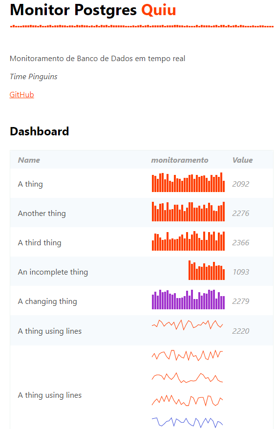

<h1 align="center">
  <br>
  <a href="http://www.ricardodarocha.com.br"></a>
  <br>
  Rust
  <br>
</h1>

<h4 align="center">About  </p>
A scaffold of Svelte Dashboard and Rust


<p align="center">
  <a href="#introdução">Introduction</a> •
  <a href="#como-usar">How to use</a> •
  <a href="#download">Download</a> •
  <a href="#credits">References</a> •
  <a href="#related">Related</a> •
  <a href="#license">License</a>
</p>



## Introduction

Svelte is one of the lightfull frontend layers you can use. In this example we use Svelte to render some data provided by Rust actix server

**Example**
```rust


```

## How to try this


1. First clone this repository [Git](https://github.com/ricardodarocha/rust-svelte-dashboard.git) which has two layers
   1. api - provides http data
   2. dash - uses svelte to render a tiny dashboard
2. Go to api and run the server, you will need to compile it first using cargo run (Rust)
3. Go to dash and run the client

```bash
# Clone this repository
$ git clone https://github.com/ricardodarocha/rust-svelte-dashboard.git

# Go into the repository
$ cd rust-svelte-dashboard

# Open with VSCode
$ code .

# I suggest you open two terminal windows

# install and run the server
cd api
cargo check
cargo run

# install and run the client
cd dash
npm install
npm run dev
```

Dash will run at port 3000
Api will run at port 3001

## Routes

Choose some kpi

GET http://localhost/api/metricas/ALFA/30
GET http://localhost/api/metricas/GAMA/30

```js
let alfa = [{"label":"1", "value", 39.0},{"label":"2", "value", 39.0},...,{"label":"30", "value", 37.0}]
let beta = [{"label":"1", "value", 199.0},{"label":"2", "value", 179.0},...,{"label":"30", "value", 201.0}]
```
🚧 _soon_

## Download

No binary yut

## Installing svelte tiny linked cards

```js
npm install --save svelte-tiny-linked-charts

//app.svelte
<script>
import { LinkedChart, LinkedLabel, LinkedValue } from "svelte-tiny-linked-charts"
</script>

<div class="wrapper">
  <LinkedChart { data } />
</div>
```

## Using Vite

If you want to use Vite in other projects, just try this preset

```js
npm init vite@latest
√ Project name: ... new-dash
√ Select a framework: » svelte
√ Select a variant: » svelte

Scaffolding project in .\new-dash

Done. Now run:

  cd new-dash
  npm install
  npm run dev
```
## Technical considerations

**Why use this over SvelteKit?**

- It brings its own routing solution which might not be preferable for some users.
- It is first and foremost a framework that just happens to use Vite under the hood, not a Vite app.
  `vite dev` and `vite build` wouldn't work in a SvelteKit environment, for example.

This template contains as little as possible to get started with Vite + Svelte, while taking into account the developer experience with regards to HMR and intellisense. It demonstrates capabilities on par with the other `create-vite` templates and is a good starting point for beginners dipping their toes into a Vite + Svelte project.

Should you later need the extended capabilities and extensibility provided by SvelteKit, the template has been structured similarly to SvelteKit so that it is easy to migrate.

**Why `global.d.ts` instead of `compilerOptions.types` inside `jsconfig.json` or `tsconfig.json`?**

Setting `compilerOptions.types` shuts out all other types not explicitly listed in the configuration. Using triple-slash references keeps the default TypeScript setting of accepting type information from the entire workspace, while also adding `svelte` and `vite/client` type information.

**Why include `.vscode/extensions.json`?**

Other templates indirectly recommend extensions via the README, but this file allows VS Code to prompt the user to install the recommended extension upon opening the project.

**Why enable `checkJs` in the JS template?**

It is likely that most cases of changing variable types in runtime are likely to be accidental, rather than deliberate. This provides advanced typechecking out of the box. Should you like to take advantage of the dynamically-typed nature of JavaScript, it is trivial to change the configuration.

**Why is HMR not preserving my local component state?**

HMR state preservation comes with a number of gotchas! It has been disabled by default in both `svelte-hmr` and `@sveltejs/vite-plugin-svelte` due to its often surprising behavior. You can read the details [here](https://github.com/rixo/svelte-hmr#svelte-hmr).

If you have state that's important to retain within a component, consider creating an external store which would not be replaced by HMR.

```js
// store.js
// An extremely simple external store
import { writable } from 'svelte/store'
export default writable(0)
```


## References

This software uses [Svelte]()
This software uses [svelte-tiny-linked-charts]
This software was powered with [Vite]

## Resources

web components
basic java script
dashboard
svelte tiny linked charts _see references_
vite _see references_ 

## Related

[Rust](https://www.rust-lang.org/pt-BR) - A linguagem mais querida 🦀

## Contato

> Linkedin [ricardo-da-rocha-vitor](https://www.linkedin.com/in/ricardo-da-rocha-vitor-a0983932/)
> Site [ricardodarocha.com.br](https://www.ricardodarocha.com.br) &nbsp;&middot;&nbsp;
> GitHub [@ricardodarocha](https://github.com/ricardodarocha) &nbsp;&middot;&nbsp;
> Twitter [@ricardorochadev](https://twitter.com/ricardorochadev)


## You may also like...

- [Actix-Web](https://actix.rs/) 
- [Axum](https://docs.rs/axum/latest/axum/)
- [Tokio](https://github.com/tokio-rs)
- [async-std](https://async.rs/)


## License

GNU


---


